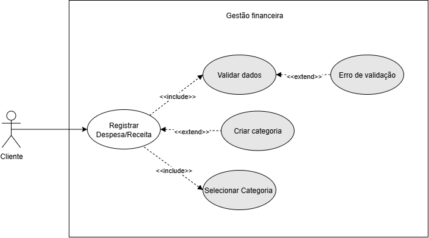
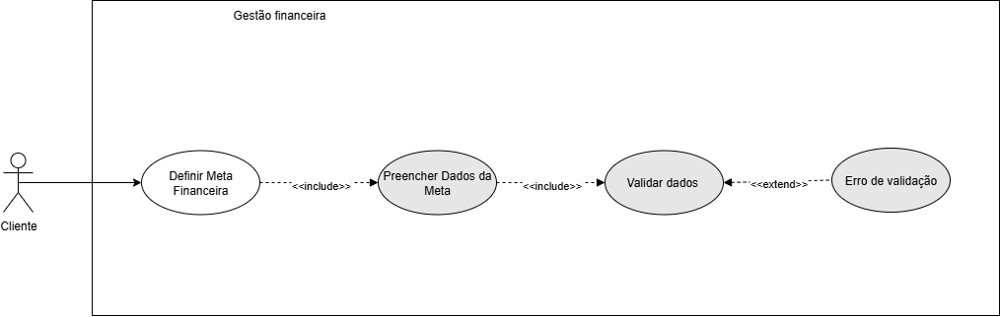
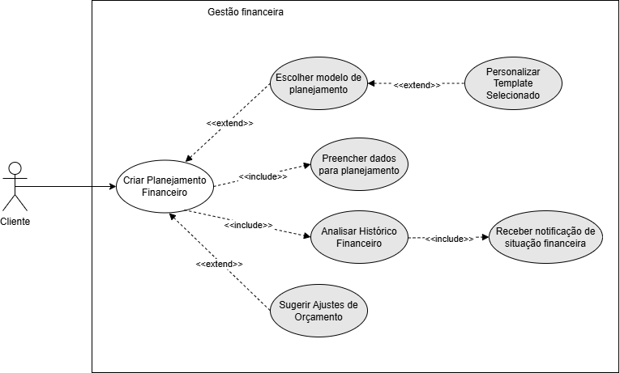
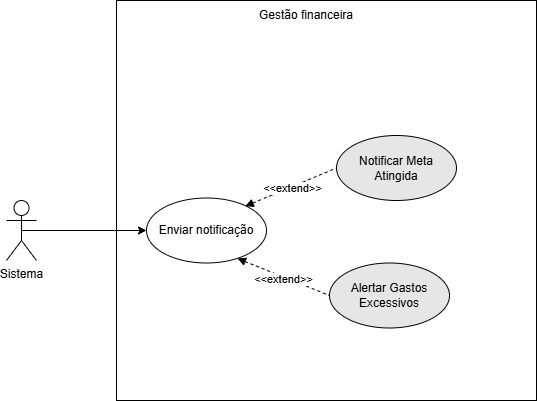
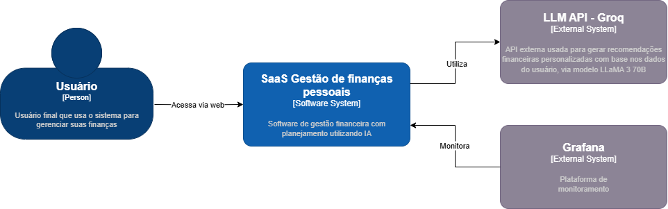
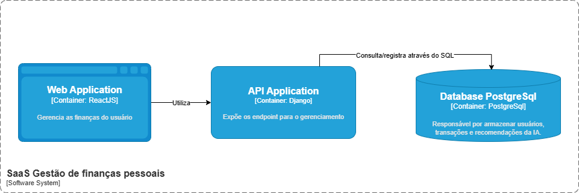
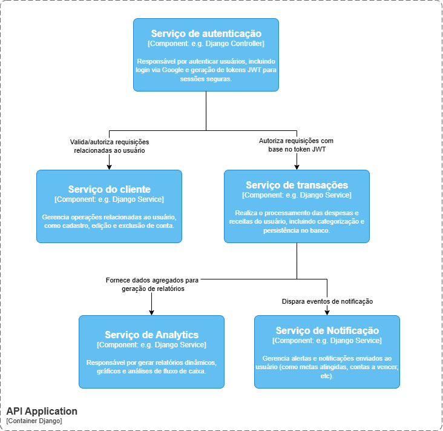
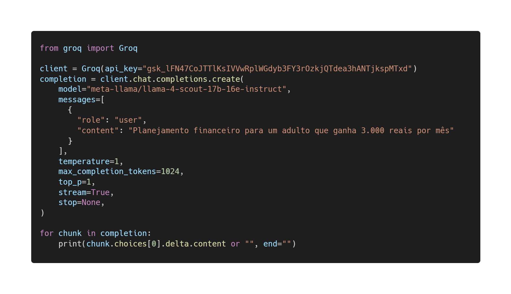

# SaaS de Gestão financeira pessoal com IA
**Estudante: Luis Felipe Mondini**

**Curso: Engenharia de Software**  
**Portfólio de projeto I**

---

**Resumo**

Este projeto propõe a criação de um SaaS (Software as a Service) voltado para a gestão financeira pessoal. A proposta visa oferecer aos usuários uma ferramenta prática e acessível para controle de receitas, despesas e planejamento financeiro, com o apoio de recursos preditivos e recomendações personalizadas baseadas no modelo de linguagem llama3-70b-8192, acessado via API da Groq. A solução incorpora práticas de engenharia de software, arquitetura escalável, segurança da informação e usabilidade, promovendo uma experiência confiável e personalizada. Além disso, aborda os desafios técnicos enfrentados, os métodos adotados para mitigação de riscos e as tecnologias aplicadas ao longo do projeto.

---

## Introdução

Com o crescimento das transações digitais e a complexidade crescente na gestão das finanças pessoais, torna-se cada vez mais necessário o uso de soluções tecnológicas que auxiliem o usuário a manter o controle financeiro e tomar decisões estratégicas. No entanto, ferramentas tradicionais, como planilhas e aplicativos genéricos, frequentemente exigem esforço contínuo e carecem de personalização. A falta de previsibilidade e dificuldade na interpretação de dados financeiros prejudica a tomada de decisões conscientes e a adesão ao uso dessas ferramentas.

Nesse contexto, uma aplicação SaaS (Software como Serviço) oferece uma alternativa escalável e segura, permitindo acesso multiplataforma e centralização das informações financeiras. O projeto se destaca por aplicar conceitos da engenharia de software moderna, desenvolvimento full stack, integração com modelos de linguagem avançados e boas práticas de arquitetura para entregar uma plataforma intuitiva, com foco em acessibilidade, segurança e análise inteligente dos dados utilizando o modelo IA.

---

## Descrição do Projeto

Muitos indivíduos tomam decisões financeiras sem um entendimento claro do impacto futuro de seus gastos, o que frequentemente resulta em endividamento e dificuldades para atingir metas financeiras. De acordo com Klapper et al. (2019), a ausência de planejamento estruturado leva a escolhas impulsivas e compromete a estabilidade econômica pessoal. O problema não está apenas na falta de controle, mas também na dificuldade de transformar dados financeiros em projeções confiáveis. Métodos tradicionais, como planilhas e registros manuais, exigem um nível de disciplina que nem sempre é realista no cotidiano dos usuários.

Além disso, a fragmentação das informações financeiras dificulta uma visão unificada da saúde econômica do usuário. Aplicativos existentes geralmente demandam entrada manual constante e não oferecem uma forma eficiente de consolidar dados automaticamente. Esse processo pode se tornar cansativo e pouco prático, levando muitos a abandonarem o acompanhamento financeiro. A situação se agrava pelo fato de que a maioria das ferramentas do mercado não considera padrões individuais de consumo e variações de renda, tratando todos os usuários com a mesma abordagem generalista. Isso limita o potencial de personalização e impede que a tecnologia atue como um verdadeiro assistente financeiro adaptado à realidade de cada pessoa.

Outro obstáculo significativo é a complexidade das informações financeiras apresentadas. Embora gráficos e tabelas sejam recursos valiosos, nem todos os usuários possuem familiaridade com conceitos contábeis e econômicos. Muitas ferramentas falham ao traduzir essas informações em insights acionáveis, tornando difícil para o usuário compreender o que precisa ser ajustado e quais medidas tomar para melhorar sua saúde financeira. A barreira na interpretação dos dados faz com que muitos desistam do planejamento antes mesmo de alcançar benefícios concretos.

Por fim, a segurança e privacidade dos dados são preocupações fundamentais para qualquer sistema que lida com informações financeiras. Vazamentos de dados ou acessos não autorizados podem comprometer não apenas informações sensíveis, mas também a confiança do usuário na plataforma. Garantir um ambiente seguro e confiável exige boas práticas de segurança digital, algo que nem todas as soluções de gestão financeira priorizam adequadamente.

Apesar de buscar resolver esses desafios, o projeto não abordará alguns aspectos específicos. A ferramenta não terá integração bancária automática, evitando riscos regulatórios e garantindo maior segurança ao usuário. O foco será na gestão financeira pessoal, sem funcionalidades voltadas para empresas ou contabilidade corporativa. Além disso, o sistema não oferecerá recomendações de investimentos ou consultoria financeira, limitando-se a fornecer uma visão organizada e preditiva das finanças do usuário, sem atuar como um assessor financeiro.

---

## Especificação Técnica

Esta seção apresenta as especificações técnicas do sistema, detalhando as tecnologias que serão utilizadas, os requisitos funcionais e não funcionais, e a modelagem do sistema por meio de um UML de Casos de Uso. O objetivo é proporcionar uma visão completa da arquitetura e do comportamento esperado do sistema, oferecendo uma base sólida para seu desenvolvimento e futuras manutenções.

### Requisitos de Software

Esta seção apresenta os requisitos funcionais e não funcionais que definem o comportamento esperado do sistema SaaS de gestão financeira pessoal. Os requisitos funcionais descrevem as funcionalidades que o sistema deve oferecer aos usuários para atender às suas necessidades, enquanto os requisitos não funcionais tratam de aspectos técnicos e de qualidade que garantem segurança, desempenho, usabilidade e conformidade legal da aplicação. Esses requisitos foram definidos com base nas necessidades do público-alvo e nas boas práticas de desenvolvimento de software, assegurando a entrega de uma solução robusta, segura e escalável.

#### Requisitos Funcionais (RF)

| Código | Descrição |
|---|---|
| RF1 | O sistema deve permitir o cadastro de novos usuários. |
| RF2 | O sistema deve permitir a autenticação de usuários utilizando login via Google. |
| RF3 | O sistema deve permitir que o usuário altere os dados da sua conta e exclua a conta, se desejar. |
| RF4 | O sistema deve permitir o registro de despesas detalhadas, incluindo data, valor, categoria e descrição. |
| RF5 | O sistema deve categorizar automaticamente as transações registradas por tipo, como alimentação, transporte, lazer, entre outros. |
| RF6 | O sistema deve permitir que o usuário edite ou exclua transações registradas anteriormente. |
| RF7 | O sistema deve apresentar uma visão geral do fluxo de caixa do usuário, com receitas, despesas e saldo atual. |
| RF8 | O sistema deve apresentar gráficos e relatórios dinâmicos sobre o fluxo de caixa, com análises mensais, trimestrais e anuais. |
| RF9 | O sistema deve permitir que o usuário crie e personalize categorias de despesas e receitas. |
| RF10 | O sistema deve manter um histórico completo das transações registradas, com filtros por período, categoria e outros parâmetros. |
| RF11 | O sistema deve permitir que o usuário defina metas financeiras, como economizar determinado valor ou quitar dívidas. |
| RF12 | O sistema deve gerar sugestões de planejamento financeiro baseadas nas entradas e saídas do usuário, com recomendações personalizadas. |
| RF13 | O sistema deve oferecer templates padronizados de planejamento financeiro para auxiliar o usuário. |
| RF14 | O sistema deve utilizar IA para prever fluxos de caixa futuros, com base no histórico financeiro do usuário. |
| RF15 | O sistema deve recomendar ajustes no orçamento com base em padrões históricos de consumo do usuário. |
| RF16 | O sistema deve enviar notificações e alertas sobre metas atingidas, gastos excessivos, contas a vencer e outras situações relevantes. |

#### Requisitos Não-Funcionais (RNF)

| Código | Descrição |
|---|---|
| RNF1 | O sistema deve considerar o uso do Heroku como plataforma de cloud computing escalável. |
| RNF2 | O sistema deve otimizar consultas SQL utilizando o ORM do Django para garantir performance em grandes volumes de dados. |
| RNF3 | O sistema deve garantir a segurança dos dados financeiros, com criptografia de ponta a ponta para informações sensíveis. |
| RNF4 | O sistema deve implementar autenticação baseada em JWT para controle de acesso seguro. |
| RNF5 | O sistema deve estar protegido contra ataques como SQL Injection, XSS, CSRF, entre outros. |
| RNF6 | O sistema deve armazenar senhas de forma segura utilizando algoritmos como bcrypt. |
| RNF7 | O sistema deve ser responsivo e acessível, garantindo boa usabilidade em dispositivos móveis e desktop. |
| RNF8 | O sistema deve possuir design acessível com foco em legibilidade, navegação intuitiva e interação facilitada. |
| RNF9 | O sistema deve implementar monitoramento constante com logs detalhados, utilizando o Datadog. |
| RNF10 | O sistema deve ser compatível com os principais navegadores modernos (Chrome, Firefox, Edge, Safari). |
| RNF11 | O código-fonte do sistema deve ser bem documentado, facilitando manutenção e evolução. |
| RNF12 | O sistema deve incluir testes unitários e de integração para garantir estabilidade e qualidade do software. |
| RNF13 | A análise preditiva e o planejamento financeiro inteligente devem ser realizados por um modelo de linguagem (LLM) acessado via API. |
| RNF14 | O sistema deve garantir desempenho eficiente durante as operações de IA, sem impactar a performance geral da aplicação. |
| RNF15 | O sistema deve estar em conformidade com a LGPD, garantindo a proteção de dados pessoais dos usuários. |
| RNF16 | O sistema deve implementar autenticação baseada em JWT para garantir sessões seguras. |

---

### Diagrama de casos de uso (UML)

Cada caso de uso representa uma funcionalidade específica e completa que o sistema oferece para um ou mais atores, ajudando a definir o escopo do projeto, facilitar a comunicação entre stakeholders e servir como base para o planejamento e testes de desenvolvimento. Eles são essenciais para garantir que o sistema final atenda às necessidades e expectativas dos seus usuários.

#### Caso de Uso: Registrar Despesa

| Ator Principal | Usuário |
|---|---|
| **Descrição** | O usuário deseja registrar uma nova despesa ou receita com todos os detalhes necessários. |
| **Fluxo Principal** | - O usuário acessa o sistema autenticado. - Seleciona a opção “Adicionar nova transação”. - Informa: tipo (Receita ou Despesa), valor, data, categoria e descrição (opcional). - O sistema valida os dados. - A transação é salva no banco de dados. |
| **Inclusões** `<<include>>` | - Escolher categoria personalizada (RF9) - Selecionar categoria desejada (RF5). |
| **Extensões** `<<extend>>` | - Exibir mensagem de erro se algum campo for inválido. |

#### Caso de Uso: Definir Meta Financeira

| Ator Principal | Usuário |
|---|---|
| **Descrição** | O usuário deseja definir uma meta financeira específica (ex: economizar um valor, quitar uma dívida). |
| **Fluxo Principal** | - O usuário acessa a seção de metas financeiras. - Seleciona a opção “Definir nova meta”. - Informa: nome da meta, valor desejado, prazo (opcional) e tipo da meta. - O sistema preenche os dados da meta. - O sistema valida os dados da meta. - A meta é salva no sistema. |
| **Inclusões** `<<include>>` | - Preencher Dados da Meta. - Validar dados: O sistema verifica se os dados fornecidos para a meta são válidos. |
| **Extensões** `<<extend>>` | - Erro de validação: Se algum dado for inválido, uma mensagem de erro é exibida ao usuário. |

#### Caso de Uso: Criar planejamento financeiro

| Ator Principal | Usuário |
|---|---|
| **Descrição** | O usuário deseja criar um plano financeiro, podendo usar modelos, preencher dados manualmente ou receber sugestões. |
| **Fluxo Principal** | - O usuário acessa a seção de planejamento financeiro. - O usuário tem a opção de:   - Escolher um modelo de planejamento.   - Preencher os dados para o planejamento manualmente.   - Analisar seu histórico financeiro para basear o planejamento. - O usuário define seus objetivos e aloca recursos. - O planejamento financeiro é salvo. |
| **Inclusões** `<<include>>` | - Preencher dados para planejamento. - Analisar Histórico Financeiro (para auxiliar na criação do plano). |
| **Extensões** `<<extend>>` | - Escolher modelo de planejamento: Se o usuário optar por um modelo, ele seleciona um da lista. - Personalizar Template Selecionado: Se um modelo for escolhido, o usuário pode personalizá-lo. - Sugerir Ajustes de Orçamento: O sistema pode sugerir ajustes com base no histórico financeiro ou metas. |

#### Caso de Uso: Enviar Notificações e Alertas

| Ator Principal | Sistema (acionado por eventos) |
|---|---|
| **Descrição** | O sistema envia notificações aos usuários com base em eventos específicos. |
| **Fluxo Principal** | - Um evento predefinido ocorre no sistema (ex: meta atingida, gasto excessivo). - O sistema identifica os usuários relevantes para a notificação. - A notificação é gerada com o conteúdo apropriado. - A notificação é enviada ao(s) usuário(s) através do meio configurado (ex: push, e-mail). |
| **Extensões** `<<extend>>` | - **Notificar Meta Atingida**: Se uma meta financeira definida pelo usuário for atingida, uma notificação é enviada. - **Alertar Gastos Excessivos**: Se os gastos do usuário excederem um limite definido ou um padrão histórico, um alerta é enviado. |

---

### Considerações de Design

A separação entre frontend e backend foi adotada para permitir maior modularidade e independência entre as interfaces e as regras de negócio. O **React** foi escolhido por sua capacidade de criar interfaces responsivas e interativas com alto desempenho e fácil manutenção. Já o **Django** foi selecionado por oferecer uma base sólida para desenvolvimento rápido de APIs, integrando bem com bibliotecas de machine learning e oferecendo um ORM eficiente para manipulação de dados.

#### Visão Inicial da Arquitetura

O sistema será dividido em três camadas principais:

* **Frontend (React)**: responsável por toda a interface de interação com o usuário. Consome as APIs expostas pelo backend e apresenta os dados de forma clara, interativa e responsiva.
* **Backend (Django)**: expõe APIs RESTful para manipulação dos dados, controle de autenticação, lógica de negócio, segurança e integração com os módulos de inteligência artificial.
* **Serviços de IA (Python)**: responsáveis pelo processamento preditivo, geração de recomendações e análise de dados financeiros com base no modelo llama3-70b-8192.

#### Padrões de Arquitetura

O backend segue o padrão **MVC (Model-View-Controller)** adotado nativamente pelo Django, o que favorece a organização e clareza na separação das camadas de dados, regras de negócio e visualização. Além disso, a arquitetura do sistema considera princípios de microsserviços internos, isolando os módulos de IA como serviços independentes quando necessário.

### Modelagem C4

Para melhor visualização da estrutura do sistema, o modelo C4 será utilizado, dividido em níveis:

* **Contexto**: Representa o sistema no ambiente onde está inserido.

* **Contêineres**: Representa os blocos principais da aplicação, como frontend, backend, banco de dados e serviços externos.

* **Componentes**: Representa os principais módulos do backend.

---

## Stack Tecnológica

O desenvolvimento deste projeto SaaS de gestão financeira foi cuidadosamente planejado com base em tecnologias modernas e amplamente utilizadas no mercado. A escolha das ferramentas e linguagens foi feita levando em consideração fatores como performance, escalabilidade, facilidade de uso, curva de aprendizagem e comunidades de desenvolvedores. Abaixo, será explicado a stack tecnológica escolhida para o desenvolvimento do sistema e a justificativa de cada seleção:

### Linguagens

Para o back-end, foi escolhido o **Django**, um framework baseado em sua robustez, facilidade de integração com bibliotecas de machine learning e grande comunidade de desenvolvedores. Além disso, a facilidade de criação de interfaces gráficas e o suporte a bibliotecas poderosas para visualização de dados, facilitarão o desenvolvimento da dashboard interativa da aplicação. O Django oferece uma arquitetura escalável e segura, com ferramentas integradas para a criação rápida e eficiente de APIs, que são essenciais para a comunicação com o front-end.
Para o front-end, a escolha recaiu sobre **ReactJS**, que é amplamente adotado para o desenvolvimento de interfaces dinâmicas e interativas. Sua componentização facilita o desenvolvimento e a manutenção do código, além de proporcionar alta reutilização de componentes e uma integração suave com APIs, como as que serão desenvolvidas com o Django.

### Bibliotecas

Este projeto de SaaS de gestão financeira utiliza bibliotecas modernas para garantir robustez, interatividade e integração eficiente com inteligência artificial via nuvem.

* **Pandas** é utilizado para a manipulação e organização dos dados financeiros inseridos pelos usuários.
* **Plotly e Dash** são usados para a criação de dashboards interativos e visualizações dinâmicas de dados financeiros.
* **Django Rest Framework (DRF)** permite a construção de APIs escaláveis e seguras para integração entre o backend em Django e o frontend em React.
* A camada de inteligência artificial é implementada com base no modelo de linguagem **LLaMA 3 70B**, acessado via API da Groq, responsável por realizar previsões, gerar recomendações financeiras personalizadas e apoiar o planejamento dos usuários de forma contextual e eficiente, sem a necessidade de infraestrutura local para machine learning.

### Ferramentas de Desenvolvimento e Gestão de Projeto

**Análise de Código:** O uso do **SonarCloud** permite realizar uma análise contínua da qualidade do código, identificando potenciais problemas como vulnerabilidades de segurança, falhas de desempenho e padrões de código indesejados, ajudando a manter a alta qualidade do código durante todo o desenvolvimento.

**Monitoramento:** Para o monitoramento em tempo real da aplicação, foi adotado o uso do **Grafana**, uma plataforma open-source amplamente utilizada para observabilidade e visualização de métricas. Integrado a ferramentas como **Prometheus** e **Loki**, o Grafana permite a coleta, consulta e exibição de métricas, logs e alertas de forma centralizada. Através de dashboards personalizados, pode-se acompanhar indicadores como tempo de resposta, uso de CPU e memória, taxa de erros e disponibilidade de APIs. Além disso, o sistema pode ser configurado para emitir alertas automáticos em caso de falhas ou comportamentos anômalos, contribuindo para uma manutenção proativa e para a melhoria contínua da plataforma.

**Gestão de Tarefas:** Para gerenciar as tarefas e o progresso do projeto, será utilizado o **Jira**. Essa ferramenta é ideal para o acompanhamento detalhado de atividades e facilita a organização de tarefas de forma ágil e estruturada.

**Versionamento de Código e CI/CD:** O **GitHub** será a plataforma utilizada para o controle de versão. Com ele, posso gerenciar todas as versões do código-fonte de forma eficiente, além de integrar ferramentas de CI/CD como **GitHub Actions** para automatizar o processo de build, testes e deployment. Isso garante que cada mudança no código seja validada e automaticamente disponibilizada para produção, mantendo o fluxo de trabalho ágil e contínuo.

**Containers:** O uso do **Docker** para containerizar a aplicação permite que ela seja executada em qualquer ambiente de maneira consistente. Isso facilita a portabilidade entre desenvolvimento, testes e produção, além de garantir que todas as dependências sejam isoladas e bem definidas.

### Banco de Dados

O sistema utiliza o banco de dados relacional **PostgreSQL**, escolhido por sua robustez, confiabilidade e aderência a requisitos típicos de aplicações financeiras. O PostgreSQL oferece suporte completo a transações ACID (Atomicidade, Consistência, Isolamento e Durabilidade), garantindo segurança e integridade dos dados financeiros, mesmo em cenários de concorrência e falhas inesperadas. Além disso, o sistema realiza consultas complexas, como agregações mensais, projeções baseadas em histórico e cruzamentos entre diferentes tipos de transações (despesas fixas, metas atingidas, receitas eventuais). O PostgreSQL se destaca nesse aspecto por sua poderosa linguagem SQL com suporte a funções de janela, subconsultas, CTEs (Common Table Expressions) e índices otimizados.

Considerando a natureza do sistema — que envolve armazenamento contínuo de dados financeiros por múltiplos usuários, histórico de metas, relatórios, templates personalizados e logs de interações com a IA — estima-se um volume de dados crescente, tornando essencial o uso de um banco escalável e com bom desempenho em leitura e escrita. A escolha do PostgreSQL também se justifica pela necessidade de integridade referencial entre entidades (usuários, metas, transações, planos de IA), pela compatibilidade com ferramentas modernas de ORM (Object-Relational Mapping) como *Django ORM* e *SQLAlchemy*, e pela facilidade de integração com serviços externos e ambientes em nuvem.

Por fim, foram considerados bancos alternativos como *MySQL* (com limitações no suporte a algumas operações analíticas) e bancos *NoSQL* como *MongoDB* (menos adequados para a modelagem relacional adotada), sendo o PostgreSQL o que melhor atende aos requisitos técnicos e operacionais do projeto.

### Integração com Modelo de Linguagem

Para implementar as funcionalidades de planejamento financeiro inteligente e previsões personalizadas, o sistema utiliza o **LLaMA 3 70B**, um modelo de linguagem de última geração desenvolvido pela Meta, acessado por meio da API da Groq. Essa abordagem elimina a necessidade de treinamento local de modelos, reduzindo significativamente a complexidade de implementação e os requisitos de infraestrutura computacional.

**Fluxo de Integração**

* **Coleta e Preparação de Dados:** Os dados financeiros inseridos pelo usuário são processados e transformados em prompts estruturados, otimizados para comunicação com o modelo.
* **Envio para API Groq:** Os prompts são enviados via requisição HTTP para o LLaMA 3 70B, utilizando a API de alta performance da Groq.
* **Processamento de Respostas:** As respostas retornadas pelo modelo são interpretadas, estruturadas e armazenadas para uso posterior.
* **Apresentação ao Usuário:** As recomendações e previsões são exibidas na interface de forma amigável, clara e acionável.

**Exemplos de Aplicação**

* **Análise de Padrões de Gastos:** O modelo identifica padrões de comportamento financeiro e sugere possíveis ajustes para otimização dos gastos.
* **Previsão de Despesas Futuras:** Baseado no histórico do usuário, o LLaMA 3 70B realiza projeções de despesas, considerando tendências e recorrências.
* **Templates personalizados de planejamento:** Geração de sugestões de planejamento, com parâmetros personalizáveis, gerando um plano com linguagem natural e contexto.

---

**Exemplos do uso da API:**

**Limites da API do modelo:**

| Modelo             | Requisições/min | Requisições/dia | Tokens/min | Tokens/dia |
| :----------------- | :-------------- | :-------------- | :--------- | :--------- |
| `llama3-70b-8192` | 30              | 14.400          | 6.000      | 500.000    |

**Considerações Técnicas**

* Implementação de cache para reduzir chamadas repetidas à API e melhorar o tempo de resposta.
* Estratégias de fallback para garantir robustez em caso de falha ou lentidão no serviço.
* Validação de respostas para garantir que os dados retornados sejam coerentes, seguros e úteis.
* Processamento assíncrono para evitar bloqueios durante interações com a API da Groq.

**Exemplos de Prompts**

* **Prompt:**

    > "Analise as seguintes transações financeiras do último trimestre: [dados]. Identifique padrões de gastos excessivos e sugira três áreas específicas onde o usuário poderia economizar."

    **Resposta esperada:** Uma análise textual clara, apontando categorias de despesas críticas, explicando os padrões identificados e sugerindo formas práticas de economia.

* **Prompt:**

    > "Com base no histórico de receitas e despesas dos últimos 6 meses: [dados], projete o fluxo de caixa para os próximos 3 meses, considerando tendências sazonais e compromissos recorrentes."

    **Resposta esperada:** Projeção detalhada com estimativas mensais de receitas e despesas, destacando possíveis déficits ou superávits, além de sugestões para manter o equilíbrio financeiro.

---

## Considerações de Segurança

Embora o sistema não realize transações bancárias reais nem processe dados de cartões de crédito, ele lida com informações financeiras sensíveis inseridas manualmente pelos usuários, como receitas, despesas, metas e históricos de planejamento. Por isso, a segurança da informação é tratada como uma prioridade, tanto do ponto de vista técnico quanto regulatório. O sistema utiliza autenticação baseada em tokens JWT (JSON Web Tokens), garantindo que apenas usuários devidamente autenticados possam acessar seus próprios dados. A autorização é restrita por escopo, evitando exposição indevida entre contas de usuários diferentes. As credenciais são armazenadas de forma segura, utilizando o algoritmo **bcrypt**, com aplicação de hash e *salt* nas senhas, de modo a proteger os dados mesmo em caso de comprometimento da base. Para mitigar riscos de segurança comuns, o *backend* desenvolvido em Django aplica boas práticas de codificação segura, com proteção nativa contra *SQL Injection*, *Cross-Site Scripting* (XSS) e *Cross-Site Request Forgery* (CSRF). O framework fornece suporte automático a validações de entrada, tokens antifalsificação e verificação de sessões. Em conformidade com a Lei Geral de Proteção de Dados (LGPD – Lei nº 13.709/2018), o sistema adota práticas de privacidade como: coleta mínima de dados, solicitação explícita de consentimento para tratamento de informações, registro da finalidade de uso de cada dado inserido e possibilidade de exclusão permanente mediante solicitação do titular. Além disso, todas as ações críticas executadas por usuários, como criação, alteração ou exclusão de metas e transações, são registradas em logs seguros. Esses registros contêm carimbo de data e hora, identificador de usuário e operação realizada, viabilizando auditorias internas, rastreabilidade de mudanças e detecção de comportamentos anômalos.

O sistema também implementa rotinas de monitoramento e verificação periódica dos logs e acessos. Com isso, padrões incomuns de uso, como múltiplas tentativas de login ou acessos simultâneos não usuais, podem ser detectados e sinalizados automaticamente para a equipe técnica. Essas medidas garantem que, mesmo em um modelo de uso simplificado, a aplicação esteja alinhada às boas práticas de segurança e esteja em conformidade com os requisitos legais, assegurando a confidencialidade, integridade e disponibilidade dos dados financeiros dos usuários.

---

## Próximos Passos

Com a documentação inicial consolidada, os próximos passos do projeto se concentram na transição para a fase prática do desenvolvimento, estruturada em duas partes:

* Criação do repositório no GitHub e configuração da infraestrutura básica (Docker, CI/CD).
* Implementação do **MVP** (mínimo produto viável), com cadastro de usuários, login e funcionalidades básicas de receitas e despesas.
* Definição da base do modelo preditivo com dados fictícios para testes iniciais.
* Criação dos primeiros testes unitários e integração do sistema com ferramentas de monitoramento.
* Expansão das funcionalidades, como metas financeiras, análise preditiva e geração de relatórios inteligentes.
* Integração total entre *frontend* e *backend* via APIs RESTful.
* Otimização da performance do sistema e realização de testes de carga.
* Preparação da versão final para demonstração, com refinamento da interface e consolidação da documentação técnica e do relatório final.
* Refinamento dos protótipos de interface com base em testes de usabilidade.
* Implementação da integração com a API da Groq para acesso ao LLaMA 3 70B.
* Desenvolvimento de *prompts* otimizados para extrair o melhor desempenho do modelo em contextos financeiros.
* Testes de usabilidade focados na interação do usuário com as recomendações baseadas em IA.
* Avaliação de métricas de satisfação do usuário com as previsões e insights gerados pelo modelo.
* Implementação de medidas adicionais de segurança e privacidade.

Essa divisão permitirá que o projeto evolua de forma controlada e consistente, garantindo entregas parciais de valor até a conclusão total da solução.

---

## Referências

* Klapper, L. et al. (2019). *Financial literacy around the world*. World Bank.
* Groq Inc. (2025). *GroqCloud API Documentation*. <https://console.groq.com/docs>
* Meta AI. (2024). *LLaMA 3 Technical Report*. <https://llama.meta.com/>
* <https://www.treasy.com.br/blog/graficos-financeiros/>
* <https://blog.nubank.com.br/planejamento-financeiro-pessoal/>
* <https://wise.com/br/blog/planejamento-financeiro-com-ia>
* <https://www.luiztools.com.br/post/12-dicas-para-construcao-de-um-bom-saas/>
* <https://journalmediacritiques.com/index.php/jmc/article/view/85>
